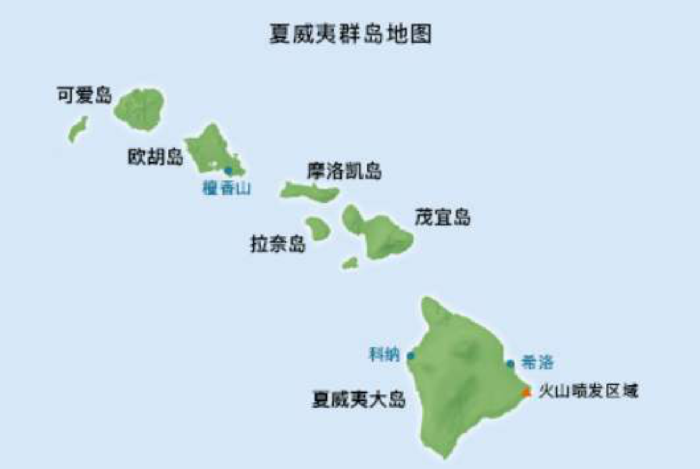

# 岛屿

> 现在给你一张地图的网格描述，一个由 '1' （陆地）和 '0' （水）组成的的二维网格，每座岛屿只能
由水平方向或竖直方向上相邻的陆地连接形成，请你统计出该地图中有多少个岛屿？



### 示例 1:
```
输入: 11110 11010 11000 00000 

输出: 1
```
### 示例 2:
```
输入: 11000 11000 00100 00011 

输出: 3
```

### 请按以下函数实现
```js
/**
 * @param {character[][]} 网格数组 
 * @return {number} 
 */ 

function numIslands(grid) { 

};
```