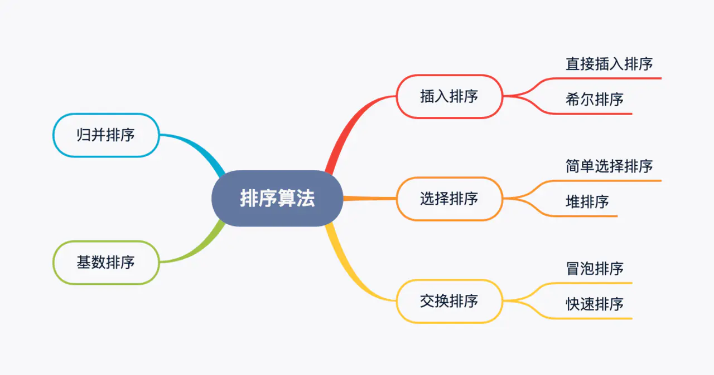

# 归并、快排、堆排有何区别?

|排序|时间复杂度(最好情况)|时间复杂度(最坏情况)|空间复杂度|稳定性|
|:--------:|:--------:|:--------:|:--------:|:--------:|
|快速排序|O(nlogn)|O(n^2)|O(logn)~O(n)|不稳定|
|归并排序|O(nlogn)|O(nlogn)|O(n)|稳定|
|堆排序|O(nlogn)|O(nlogn)|O(1)|不稳定|

* [题目来源](https://juejin.im/post/5e8b261ae51d4546c0382ab4#heading-70)