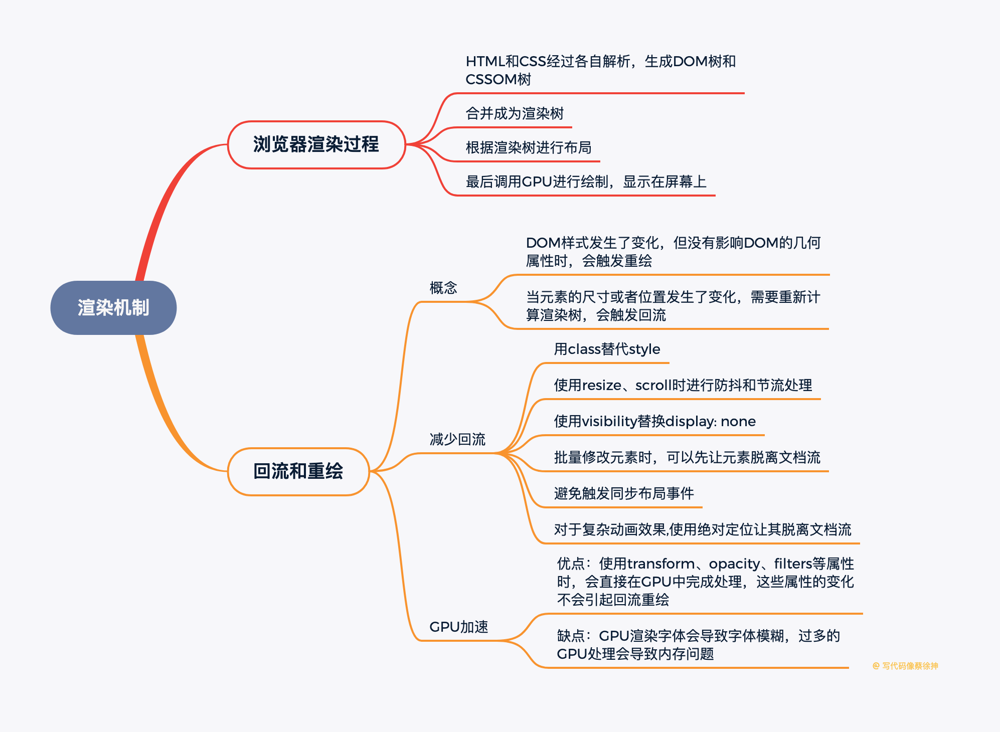

# 如何减少回流？

### 什么是回流(重排 reflow)？

> 回流（重排 reflow）：对DOM树进行渲染，只要修改DOM或修改元素的形状大小，就会触发reflow，reflow的时候，浏览器会使已渲染好受到影响的部分失效，并重新构造这部分，完成reflow后，浏览器会重新绘制受影响的部分到屏幕中

### 什么是重绘(repaint)？

> 重绘(repaint)：当我们对DOM的修改导致的样式变化，但未影响几何属性时，浏览器不需要重新计算元素的几何属性，直接可以为该元素绘制新的样式，跳过了回流环节，这个过程就叫重绘。

**回流必定会发生重绘，重绘不一定发生回流**

**答案：**

- 1、直接改变`className`，如果动态改变样式，则使用`cssText`（减少设置多项内联样式）

- 2、让要操作的元素进行`“离线处理”`，处理完后一起更新

  当使用`DocumentFragment`进行缓存操作，引发一次回流和重绘

  使用`display:none` 技术，只引发两次回流和重绘

  使用`cloneNode(true or false)`和`replaceChild`技术，引发一次回流和重绘

  使用`visibility`替换`display: none`，因为前者只会引起重绘，后者会引发回流

- 3、不要经常访问会引起浏览器`flush`队列的属性，如果你确实要访问，利用缓存

- 4、让元素脱离动画流，减少`render` 树的规模

- 5、牺牲平滑度换取速度, 使用resize、scroll时进行防抖和节流处理，这两者会直接导致回流

- 6、避免使用table布局

- 7、IE中避免使用javascript表达式

- 8、对于复杂动画效果,使用绝对定位让其脱离文档流，复杂的动画效果会频繁地触发回流重绘，我们可以将动画元素设置绝对定位从而脱离文档流避免反复回流重绘。

- 9、避免触发同步布局事件，我们在获取offsetWidth这类属性的值时，可以使用变量将查询结果存起来，避免多次查询，每次对offset/scroll/client等属性进行查询时都会触发回流

- 10、批量修改元素时，可以先让元素脱离文档流，等修改完毕后，再放入文档流

* [题目来源](https://juejin.im/post/5e8b261ae51d4546c0382ab4#heading-27)