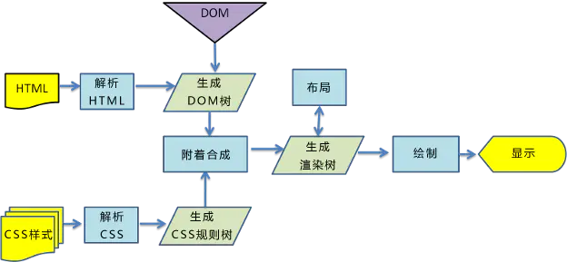

# 浏览器的渲染过程

### 关键渲染路径

!> 关键渲染路径是指浏览器从最初接收请求来的HTML、CSS、javascript等资源，然后解析、构建树、渲染布局、绘制，最后呈现给用户能看到的界面这整个过程。

### 渲染过程

- 1、浏览器将获取的HTML文档解析成DOM树。
- 2、处理CSS标记，构成层叠样式表模型CSSOM(`CSS Object Model`)。
- 3、将DOM和CSSOM合并为渲染树(`rendering tree`)，代表一系列将被渲染的对象。
- 4、渲染树的每个元素包含的内容都是计算过的，它被称之为布局`layout`。浏览器使用一种流式处理的方法，只需要一次绘制操作就可以布局所有的元素。
- 5、将渲染树的各个节点绘制到屏幕上，这一步被称为绘制`painting`。

**推荐阅读：**

* [浏览器渲染原理与过程](https://www.jianshu.com/p/e6252dc9be32)