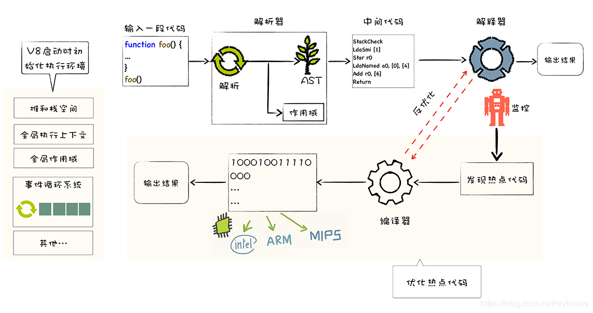

# V8如何执行一段JS代码

- 1、**预解析**：检查语法错误但不生成AST
- 2、**生成AST、作用域**：经过词法/语法分析，生成抽象语法树AST，AST是便于 V8 理解的结构；在生成 AST 的同时，V8 还会 生成相关的作用域，作用域中存放相关变量；
- 3、**生成字节码**：基线编译器(Ignition)将AST转换成字节码
- 4、**生成机器码**：优化编译器(Turbofan)将字节码转换成优化过的机器码，此外在逐行执行字节码的过程中，如果一段代码经常被执行，那么V8会将这段代码直接转换成机器码保存起来，下一次执行就不必经过字节码，优化了执行速度

**推荐阅读：**

* [V8 是怎么跑起来的 —— V8 的 JavaScript 执行管道](https://juejin.im/post/5dc4d823f265da4d4c202d3b)
* [JavaScript 引擎 V8 执行流程概述](https://mp.weixin.qq.com/s/t__Jqzg1rbTlsCHXKMwh6A)
* [V8是如何执行JavaScript代码的](https://blog.csdn.net/wyhstars/article/details/105226117)