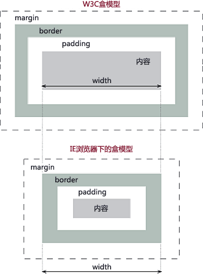

# 介绍一下标准的CSS的盒子模型？与低版本IE的盒子模型有什么不同的？

> CSS盒模型本质上是一个盒子，封装周围的HTML元素，它包括：边距，边框，填充，和实际内容。

> 盒模型允许我们在其它元素和周围元素边框之间的空间放置元素。

- `Margin(外边距)` - 清除边框外的区域，外边距是透明的。
- `Border(边框)` - 围绕在内边距和内容外的边框。
- `Padding(内边距)` - 清除内容周围的区域，内边距是透明的。
- `Content(内容)` - 盒子的内容，显示文本和图像。

> `标准盒子模型：宽度=内容的宽度（content）+ border + padding + margin`

> `低版本IE盒子模型：宽度=内容宽度（content+border+padding）+ margin`

**参考资料：**

  [CSS盒子模型](http://www.runoob.com/css/css-boxmodel.html)