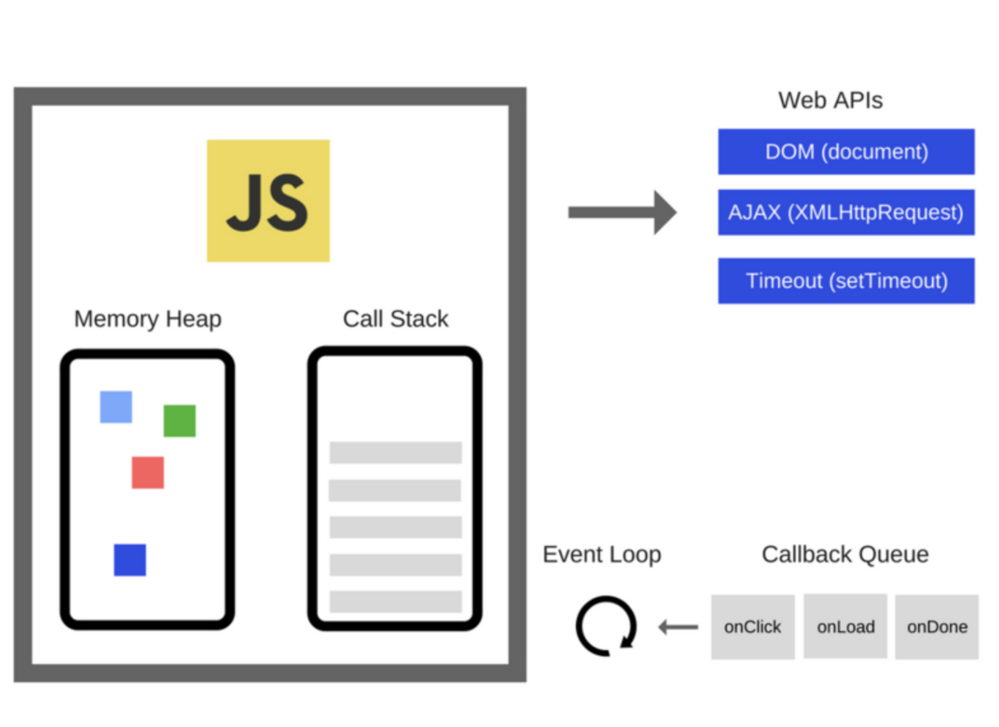

# setTimeout的执行原理(EventLoop)

> `setTimeout()`函数：用来指定某个函数或某段代码在多少毫秒之后执行。它返回一个整数，表示定时器timer的编号timeoutID，可以用来取消该定时器。

setTimeout调用的时候，JavaScript引擎会启动定时器timer，大约millisec(ms)以后执行code，当定时器时间到，就把该事件放到主事件队列等待处理。

Javascript是单线程的，任务队列的所有任务分为两种：`同步任务（synchronous）`、`异步任务（asynchronous）`

### 同步任务

> 在主线程上排队执行的任务，只有前一个任务执行完毕，才能执行后一个任务。

- 输出：`console.log()`
- 变量的声明
- 同步函数：如果在函数返回的时候，调用者就能够拿到预期的返回值或者看到预期的效果，那么这个函数就是同步的。

### 异步任务

- setTimeout和setInterval
- DOM事件
- Promise
- process.nextTick
- fs.readFile
- http.get
- 异步函数：如果在函数返回的时候，调用者还不能够得到预期结果，而是需要在将来通过一定的手段得到，那么这个函数就是异步的。

> 任务队列又分为macro-task（宏任务）与micro-task（微任务），在ES5标准中，它们被分别称为task与job。

#### 宏任务

`I/O`、`setTimeout`、`setInterval`、`setImmdiate`、`requestAnimationFrame`

#### 微任务

`process.nextTick`、`Promise`、`Promise.then`、`MutationObserver`

宏任务和微任务的执行顺序
一次事件循环中，先执行宏任务队列里的一个任务，再把微任务队列里的所有任务执行完毕，再去宏任务队列取下一个宏任务执行。

注：在当前的微任务没有执行完成时，是不会执行下一个宏任务的。

> **异步任务要挂起，先执行同步任务，同步任务执行完毕才会响应异步任务。**

### 事件循环 Event Loop

**推荐阅读：**

* [如何通过setTimeout理解JS运行机制详解](https://www.jb51.net/article/158333.htm)