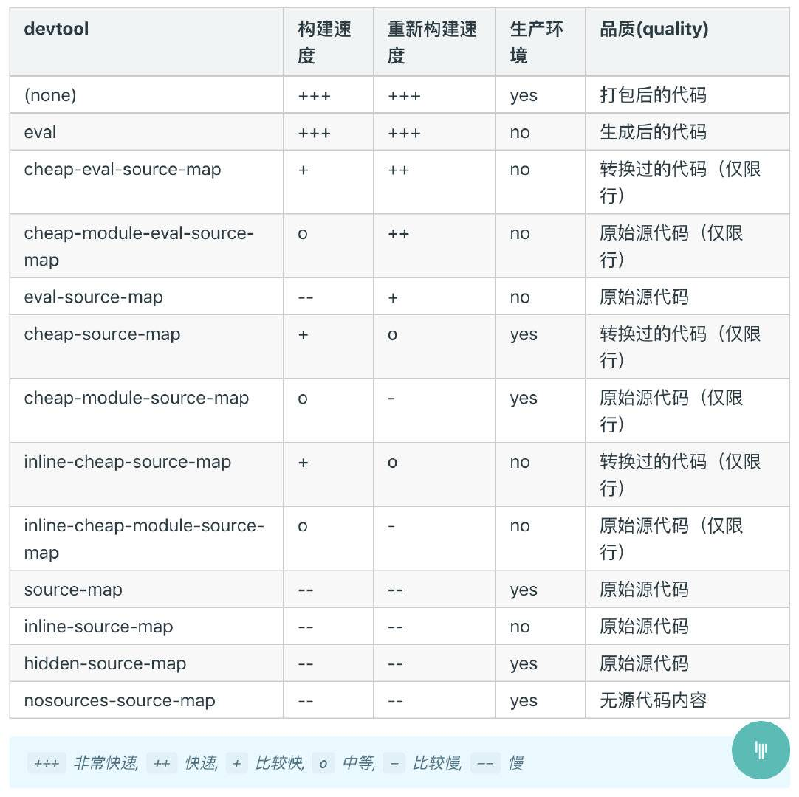

# webpack 中，sourse-map的eval、cheap、inline 和 module 各是什么意思？

!> sourse-map源码和转换后代码的映射文件

### eval

!> 打包后的模块都使用 eval() 执行，行映射可能不准；不产生独立的 map 文件

### cheap

!> map 映射只显示行不显示列，忽略源自 loader 的 source map

### inline

!> 映射文件以 base64 格式编码，加在 bundle 文件最后，不产生独立的 map 文件

### module

!> 增加对 loader source map 和第三方模块的映射

**参考资料：**
[webpack](https://webpack.docschina.org)

**题目来源：**
[webpack 中那些最易混淆的 5 个知识点](https://juejin.im/post/5cede821f265da1bbd4b5630)