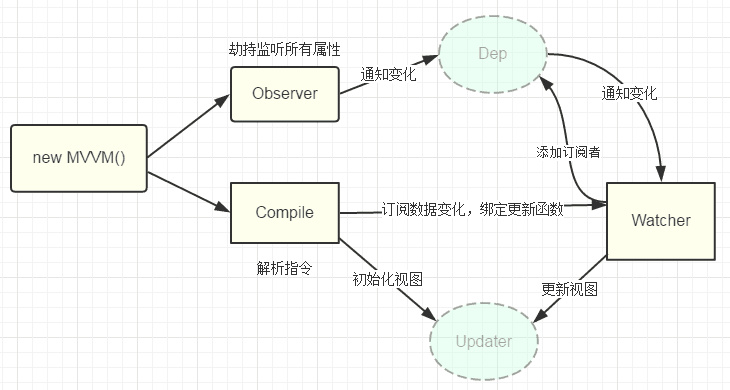

# 你能写一个 Vue 的双向数据绑定吗？

[原文链接](https://segmentfault.com/a/1190000014274840)

?> Vue的双向数据绑定的原理: 主要是通过 `Object对象` 的 `defineProperty` 属性，重写`data`的`set`和`get`函数来实现的,这里对原理不做过多描述，主要还是来实现一个实例。为了使代码更加的清晰，这里只会实现最基本的内容，主要实现v-model，v-bind 和v-click三个命令，其他命令也可以自行补充



### 实现方法：

- **1、页面结构**

```html
<div id="app">
  <form>
    <input type="text"  v-model="number">
    <button type="button" v-click="increment">增加</button>
  </form>
  <h3 v-bind="number"></h3>
</div>

//  1. 一个input，使用v-model指令
//  2. 一个button，使用v-click指令
//  3. 一个h3，使用v-bind指令。
```

- **2、通过类似于vue的方式来使用我们的双向数据绑定，结合我们的数据结构添加注释**

```js
var app = new myVue({
  el:'#app',
  data: {
    number: 0
  },
  methods: {
    increment: function() {
      this.number ++;
    },
  }
})
```

- **3、定义一个myVue构造函数**

```js
function myVue(options) {
  
}
```

- **4、初始化这个构造函数，给它添加一 个_init属性**

```js
function myVue(options) {
  this._init(options);
}
myVue.prototype._init = function (options) {
  this.$options = options;  // options 为上面使用时传入的结构体，包括el,data,methods
  this.$el = document.querySelector(options.el); // el是 #app, this.$el是id为app的Element元素
  this.$data = options.data; // this.$data = {number: 0}
  this.$methods = options.methods;  // this.$methods = {increment: function(){}}
}
```

- **5、实现_obverse函数，对data进行处理，重写data的set和get函数,并改造_init函数**

```js
myVue.prototype._obverse = function (obj) { // obj = {number: 0}
  var value;
  for (key in obj) {  //遍历obj对象
    if (obj.hasOwnProperty(key)) {
      value = obj[key]; 
      if (typeof value === 'object') {  //如果值还是对象，则遍历处理
        this._obverse(value);
      }
      Object.defineProperty(this.$data, key, {  //关键
        enumerable: true,
        configurable: true,
        get: function () {
          console.log(`获取${value}`);
          return value;
        },
        set: function (newVal) {
          console.log(`更新${newVal}`);
          if (value !== newVal) {
            value = newVal;
          }
        }
      })
    }
  }
}
 
myVue.prototype._init = function (options) {
  this.$options = options;
  this.$el = document.querySelector(options.el);
  this.$data = options.data;
  this.$methods = options.methods;
  
  this._obverse(this.$data);
}
```

- **6、写一个指令类Watcher，用来绑定更新函数，实现对DOM元素的更新**

```js
function Watcher(name, el, vm, exp, attr) {
  this.name = name;         //指令名称，例如文本节点，该值设为"text"
  this.el = el;             //指令对应的DOM元素
  this.vm = vm;             //指令所属myVue实例
  this.exp = exp;           //指令对应的值，本例如"number"
  this.attr = attr;         //绑定的属性值，本例为"innerHTML"

  this.update();
}

Watcher.prototype.update = function () {
  this.el[this.attr] = this.vm.$data[this.exp]; //比如 H3.innerHTML = this.data.number; 当number改变时，会触发这个update函数，保证对应的DOM内容进行了更新。
}
```

- **7、写一个指令类Watcher，用来绑定更新函数，实现对DOM元素的更新**

```js
function Watcher(name, el, vm, exp, attr) {
    this.name = name;         //指令名称，例如文本节点，该值设为"text"
    this.el = el;             //指令对应的DOM元素
    this.vm = vm;             //指令所属myVue实例
    this.exp = exp;           //指令对应的值，本例如"number"
    this.attr = attr;         //绑定的属性值，本例为"innerHTML"

    this.update();
  }

  Watcher.prototype.update = function () {
    this.el[this.attr] = this.vm.$data[this.exp]; //比如 H3.innerHTML = this.data.number; 当number改变时，会触发这个update函数，保证对应的DOM内容进行了更新。
  }
```

- **8、更新_init函数以及_obverse函数**

```js
myVue.prototype._init = function (options) {
  //...
  this._binding = {};   //_binding保存着model与view的映射关系，也就是我们前面定义的Watcher的实例。当model改变时，我们会触发其中的指令类更新，保证view也能实时更新
  //...
}

myVue.prototype._obverse = function (obj) {
  //...
    if (obj.hasOwnProperty(key)) {
      this._binding[key] = {    // 按照前面的数据，_binding = {number: _directives: []}                                                                                                                                                  
        _directives: []
      };
      //...
      var binding = this._binding[key];
      Object.defineProperty(this.$data, key, {
        //...
        set: function (newVal) {
          console.log(`更新${newVal}`);
          if (value !== newVal) {
            value = newVal;
            binding._directives.forEach(function (item) {  // 当number改变时，触发_binding[number]._directives 中的绑定的Watcher类的更新
              item.update();
            })
          }
        }
      })
    }
  }
}
```

- **9、如何将view与model进行绑定呢？接下来我们定义一个_compile函数，用来解析我们的指令（v-bind,v-model,v-clickde）等，并在这个过程中对view与model进行绑定**

```js
myVue.prototype._init = function (options) {
  //...
  this._complie(this.$el);
}
 
myVue.prototype._complie = function (root) { root 为 id为app的Element元素，也就是我们的根元素
  var _this = this;
  var nodes = root.children;
  for (var i = 0; i < nodes.length; i++) {
    var node = nodes[i];
    if (node.children.length) {  // 对所有元素进行遍历，并进行处理
      this._complie(node);
    }

    if (node.hasAttribute('v-click')) {  // 如果有v-click属性，我们监听它的onclick事件，触发increment事件，即number++
      node.onclick = (function () {
        var attrVal = nodes[i].getAttribute('v-click');
        return _this.$methods[attrVal].bind(_this.$data);  //bind是使data的作用域与method函数的作用域保持一致
      })();
    }

    if (node.hasAttribute('v-model') && (node.tagName == 'INPUT' || node.tagName == 'TEXTAREA')) { // 如果有v-model属性，并且元素是INPUT或者TEXTAREA，我们监听它的input事件
      node.addEventListener('input', (function(key) {  
        var attrVal = node.getAttribute('v-model');
          //_this._binding['number']._directives = [一个Watcher实例]
          // 其中Watcher.prototype.update = function () {
          //    node['vaule'] = _this.$data['number'];  这就将node的值保持与number一致
          // }
        _this._binding[attrVal]._directives.push(new Watcher(  
          'input',
          node,
          _this,
          attrVal,
          'value'
        ))

        return function() {
          _this.$data[attrVal] =  nodes[key].value; // 使number 的值与 node的value保持一致，已经实现了双向绑定
        }
      })(i));
    } 

    if (node.hasAttribute('v-bind')) { // 如果有v-bind属性，我们只要使node的值及时更新为data中number的值即可
      var attrVal = node.getAttribute('v-bind');
      _this._binding[attrVal]._directives.push(new Watcher(
        'text',
        node,
        _this,
        attrVal,
        'innerHTML'
      ))
    }
  }
}
```

### DEMO实例

[cinwell website](./example.html ':include :type=iframe width=100% height=200px')

**参考资料：**

[剖析Vue原理&实现双向绑定MVVM](https://segmentfault.com/a/1190000006599500)

[原文链接](https://segmentfault.com/a/1190000014274840)
